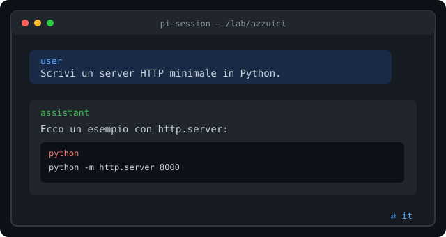
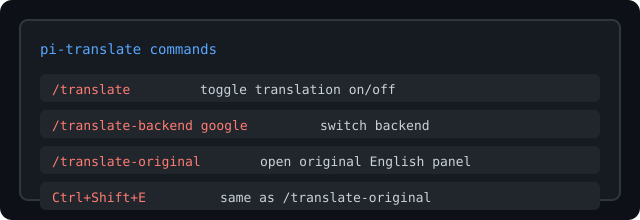
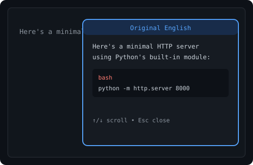

# pi-translate

[](https://github.com/kinderp/pi-translate/releases)
[](./LICENSE)
[](https://github.com/earendil-works/pi-coding-agent)

> Write in Italian. Think in English. Read in Italian.

`pi-translate` is a [pi](https://github.com/earendil-works/pi-coding-agent) extension that silently translates your prompts to English before the model sees them, then translates the model's replies back to your language in the transcript. The original English is always one keystroke away.

---

## ✨ What it does

- **Prompts go to the model in English** — every user message is translated before it enters the LLM context.
- **Replies appear in your language** — assistant messages are translated back at the end of generation.
- **Original English on demand** — press `Ctrl+Shift+E` to open a native overlay panel with the untouched response.
- **Code stays intact** — fenced blocks, inline code, `@file` references, URLs and absolute paths are protected during translation.



---

## 🚀 Install

```bash
# clone anywhere
git clone https://github.com/kinderp/pi-translate.git

# run once
cd pi-translate
pi -e ./translate/index.ts

# or install permanently
pi install ./translate/index.ts
```

Default config is written to `~/.pi/agent/translate.json`.

---

## ⌨️ Four commands to know



| Command | What it does |
|---|---|
| `/translate` | Toggle the whole extension on or off. |
| `/translate-backend <backend>` | Switch backend: `google`, `mymemory`, `libretranslate`, `llm`. |
| `/translate-original` | Open the original-English overlay panel. |
| `Ctrl+Shift+E` | Same as `/translate-original`, instant. |

More: `/translate-lang`, `/translate-mode`, `/translate-protect`, `/translate-status`, `/translate-mirror <path>`.

---

## 🪟 Peek at the original

When the Italian reply is on screen, hit `Ctrl+Shift+E`:



The panel scrolls with arrow keys / Page Up / Page Down and closes with `Esc` or `q`.

---

## ⚙️ Configuration

`~/.pi/agent/translate.json`:

```json
{
  "enabled": true,
  "sourceLang": "it",
  "backend": "google",
  "outputMode": "translate",
  "protectCode": true,
  "showFooterStatus": true,
  "originalShortcut": "ctrl+shift+e",
  "mirrorFile": "",
  "llm": { "provider": "google", "model": "gemini-2.5-flash" }
}
```

| Backend | Notes |
|---|---|
| `google` | Free `client=gtx` endpoint, auto-detects source language. Default. |
| `mymemory` | Free `api.mymemory.translated.net`. |
| `libretranslate` | Self-hosted or public instance via `LIBRETRANSLATE_URL`. |
| `llm` | Any model registered in `pi` via `modelRegistry`. |

---

## 🎯 Modes

- **`translate`** (default) — prompts are translated to English; replies are translated back. Original English viewable on demand.
- **`native`** — prompts are still translated to English, but the model is asked to reply directly in your source language. No output flip, no original panel.

---

## 📦 Release

Latest: **[v1.0.1](https://github.com/kinderp/pi-translate/releases/tag/v1.0.1)**

## 📄 License

MIT
